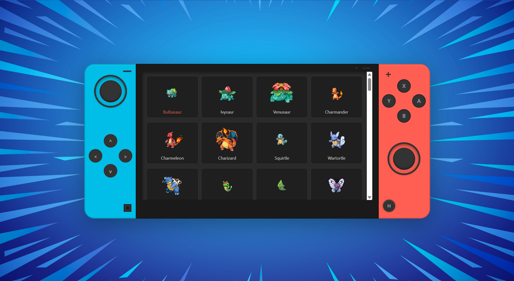
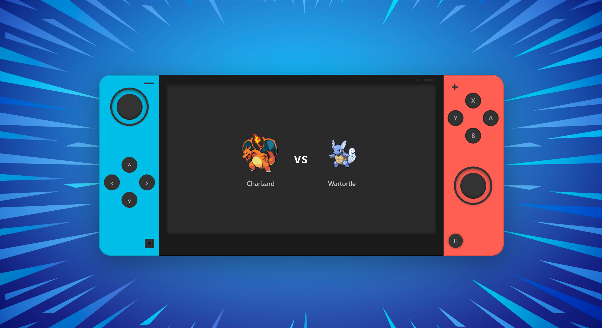

# Console Retro Game

A retro-style console UI that shows a grid of Pokémon fetched from the [PokéAPI](https://pokeapi.co/). Built with **React**, **Vite**, and **Tailwind CSS**.



## Features

- **Grid navigation** (left Joy-Con, D-pad): move through the list of 100 Pokémon on a 4-column grid.
  - **Up** / **Down**: jump one row (position changes by ±4).
  - **Left** / **Right**: move one Pokémon at a time (position changes by ±1).
  - The selected Pokémon is highlighted in a different color.
  - If you try to move outside valid bounds, the selection resets to the starting position (1).

- **A button** (right Joy-Con): confirms the Pokémon you are on. Then:
  - Your chosen Pokémon is shown.
  - The computer picks a random Pokémon from the 100.
  - The screen shows the battle view with **VS** between both.
  

- **Home button** (**H** on the right Joy-Con): returns to the list, resets the position to the first Pokémon, and clears the battle selection.

The **X**, **Y**, and **B** buttons are visible in the UI but have no action in this version.

## Running the project

```bash
npm install
npm run dev
```
